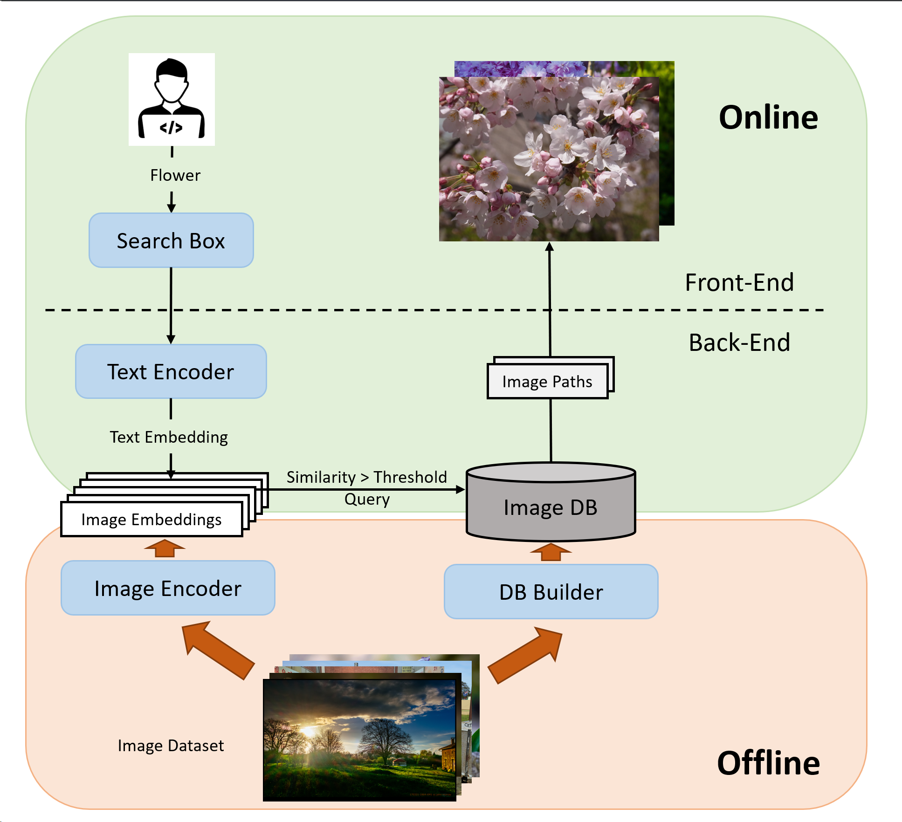
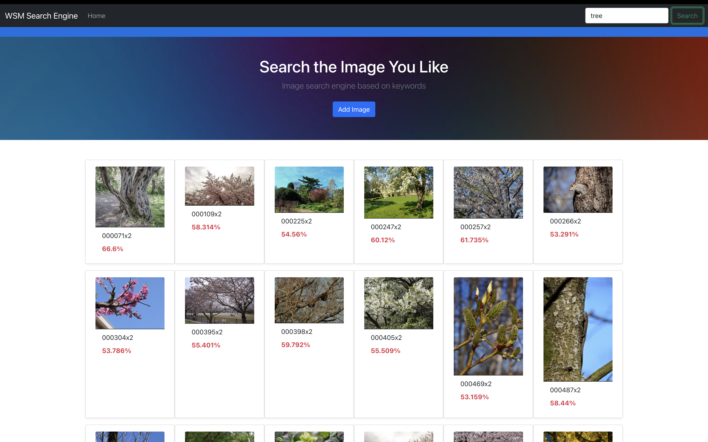

## Description
This is a demo of a text2image search engine web application that can run locally. This is dedicated to be submitted at SJTU-WSM2023 course.

- The frontend is built with React.JS + Bootstrap
- The backend is built with [Hertz](https://github.com/cloudwego/hertz/blob/develop/README_cn.md) in Golang
- The text_encoding and img_encoding abilities are built with PyTorch + CLIP

**recommanded**: to have a glimpse of this demo, you can directly wathch the `demo_vide.mp4`

## System Design

## UI Design

## Run locally
1. Put the image dataset folder into `./frontend/public/` and rename the folder to `img_dataset`
2. Prepare the database on your local test machine
   -  Run `./backend/data/build_db.py`, this will scan through `./frontend/public/img_dataset` and auto-generate `./backend/data/img.sql`
   -  Run `./backend/data/img.sql` in a DBMS (MySQL) to start the DB service at `localhost:3306`
   -  Create `app.ini` file in `./backend/conf` filling in the DBMS info (see `./backend/conf/app.ini.example`)
3. Prepare the PyTorch env according to `./backend/data/README.txt`
4. Start the backend
   -  Install Golang dev env
   -  `cd ./backend; go run .`
5. Start the frontend
   - Install Node.JS dev env
   - `cd ./frontend; npm start` (Then the Web UI should appear at http://localhost:3000)

